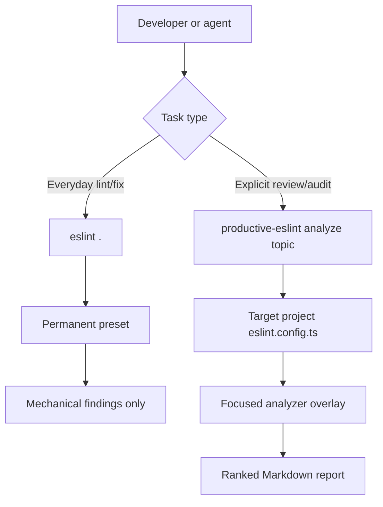

# productive-eslint Documentation

`productive-eslint` has two deliberately separate jobs:

- provide a permanent ESLint flat config for mechanical repository-wide linting;
- provide explicit, on-demand diagnostics for review and audit tasks.

The permanent config is intentionally conservative. Rules that need judgment,
product context, or architecture decisions belong in CLI analyzers instead of
always-on lint output.

## Documentation Map

- [Configuration Model](./configuration.md)
- [CLI Diagnostics](./cli-diagnostics.md)
- [Analyzer Runtime](./analyzer-runtime.md)

## High-Level Model

## Design Principles

- Permanent lint should stay mechanical and low-noise.
- Analyzers should be run only when someone explicitly asks for code quality,
  migration, risk, or review diagnostics.
- Analyzer findings should come from ESLint rules whenever an adequate rule
  surface already exists.
- Custom analyzer logic should enrich, classify, rank, and summarize findings,
  not create a second independent lint universe.
- Markdown is the default human- and agent-readable output for the current CLI.

