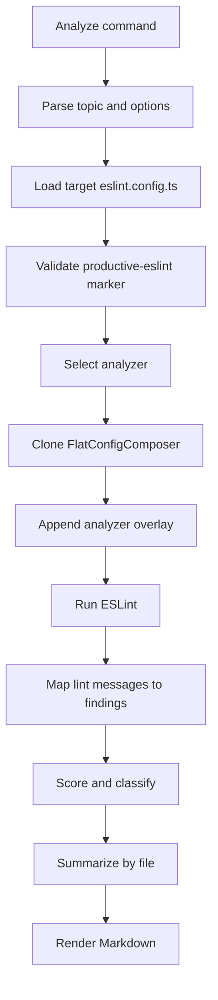
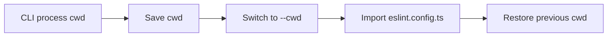
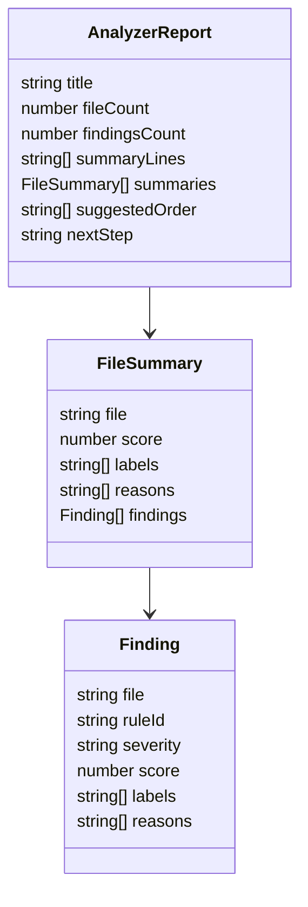

# Analyzer Runtime

Analyzers are thin diagnostic layers over the target project's ESLint setup.
They reuse the project's parser, resolver, plugins, ignores, and framework
configuration, then append topic-specific rules for the diagnostic run.

## Runtime Pipeline

## Config Loading

The loader temporarily switches `process.cwd()` to the selected `--cwd` while it
imports the target `eslint.config.ts` or `eslint.config.mts`.

This matters for project-local auto-detection. For example, Vue or RxJS support
should be detected from the target package root, not from the directory where
the CLI process happened to start.

## Report Model

Every analyzer returns the same structured report shape:

- title;
- scanned file count;
- finding count;
- summary lines;
- ranked file summaries;
- suggested order;
- next step.

Markdown is rendered from that structured model.

## Analyzer Responsibility

Analyzers should:

- reuse ESLint as the canonical finding source when possible;
- add focused rule overlays for the selected topic;
- use analyzer-local plugin namespaces when a diagnostic rule must run
  independently from the target project's optional plugin setup;
- classify and score findings;
- group findings into review-friendly hotspots;
- keep output advisory rather than punitive.

Analyzers should not:

- replace the target project's ESLint configuration;
- run implicitly during normal coding tasks;
- treat findings as process failures;
- implement a second parser or resolver model when ESLint already provides one.
