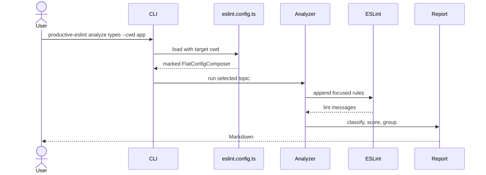

# CLI Diagnostics

The CLI runs focused diagnostics on top of the target project's real ESLint
configuration.

```bash
productive-eslint analyze risk --cwd .
productive-eslint analyze types --cwd .
productive-eslint analyze architecture --cwd .
```

## Available Topics

| Topic | Purpose |
|---|---|
| `types` | weak type boundaries, unsafe values, redundant conditions |
| `architecture` | boundary direction and private entry violations |
| `complexity` | risky functions, branch depth, duplicated or misleading control flow |
| `async` | floating promises, misused promises, suspicious async boundaries |
| `suppressions` | stale disables, broad disables, TypeScript suppressions |
| `dead-code` | safe-delete and unused-code candidates |
| `imports` | import graph, dependency shape, import hygiene hotspots |
| `api` | public contract and export policy risks |
| `vue` | Vue component contract, lifecycle, reactivity, and template safety issues |
| `rxjs` | subscription lifecycle, error handling, and reactive state boundaries |
| `migrations` | deprecated Node, TypeScript, dependency, Vue, and RxJS API usage |
| `risk` | aggregate map over universal analyzers |

`risk` intentionally runs the universal analyzer set only:

- `types`
- `architecture`
- `complexity`
- `async`
- `suppressions`
- `dead-code`
- `imports`
- `api`

Framework-specific analyzers such as `vue`, `rxjs`, and `migrations` remain
explicit commands.

## Signal Coverage

The analyzer rulesets are intentionally stronger than the permanent presets.
They are meant to surface review leads, not enforce a merge gate.

Representative signals include:

| Topic | Examples |
|---|---|
| `types` | unsafe arguments, unsafe enum comparisons, unsafe unary minus, object base stringification, unnecessary conditions |
| `async` | awaiting non-thenables, async functions without await, missing return-await in error boundaries, invalid Promise API calls |
| `complexity` | duplicated branches, identical conditions, invariant returns, nested conditionals |
| `vue` | expose or lifecycle registration after await, ref reactivity loss, untyped refs, required props with defaults |
| `rxjs` | async subscribe callbacks, missing error handlers, unsafe `takeUntil`, unbounded replay buffers, direct Subject unsubscribe |
| `migrations` | deprecated TypeScript symbols, deprecated imports, Node deprecated APIs, Vue deprecated APIs, RxJS compatibility APIs |

## CLI Flow



## Exit Codes

Finding issues is not a command failure. Exit code `1` is reserved for runtime
errors such as:

- unknown topic;
- invalid options;
- missing `eslint.config.ts` or `eslint.config.mts`;
- unsupported config shape;
- analyzer/runtime failures.

## File Targeting

The target project root is explicit:

```bash
productive-eslint analyze async --cwd services/api
```

Additional filters narrow the analyzer run:

```bash
productive-eslint analyze types --cwd . --include "src/**/*.ts" --exclude "**/*.test.ts"
```

`--top` limits only the number of rendered hotspots. It does not reduce the
underlying scan.
