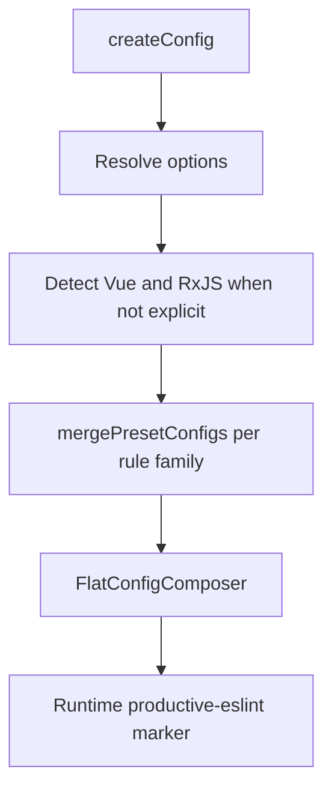
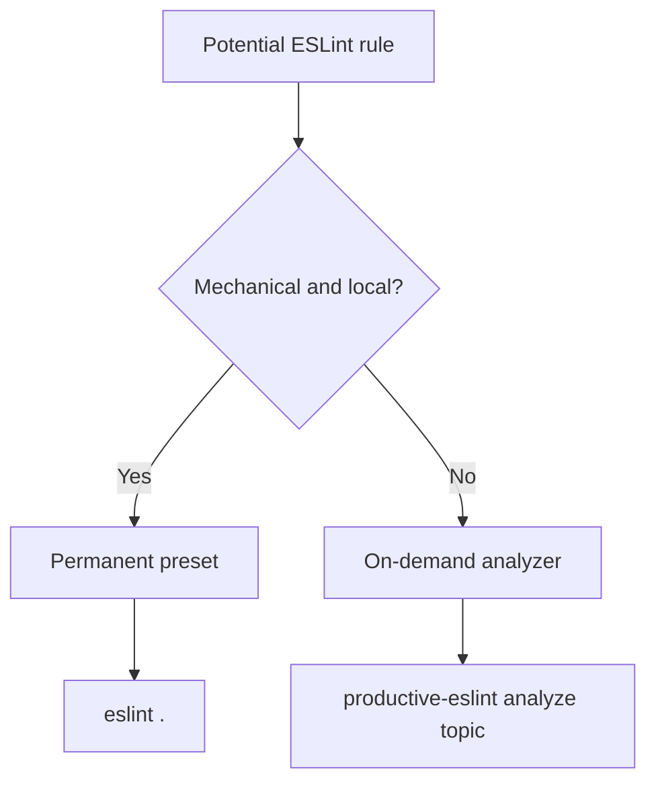

# Configuration Model

The public entry point is `createConfig(options)`.

```ts
import { createConfig, Preset } from 'productive-eslint'

export default createConfig({
  preset: Preset.RECOMMENDED,
})
```

## Presets

`Preset.AUTO_FIXABLE` enables rules with reliable ESLint autofix support.

`Preset.RECOMMENDED` is the default permanent baseline. It includes
`AUTO_FIXABLE` and adds mechanical non-autofixable rules that should not require
human design judgment.


## Config Composition

Each plugin config exports a preset map with two keys:

- `autoFixable`
- `recommended`

`mergePresetConfigs(map, preset)` composes these layers in order.



The runtime marker is important for the CLI. It lets analyzers verify that the
target project uses a supported `productive-eslint` composer pipeline rather
than an arbitrary ESLint config shape.

## Vue and RxJS

Vue and RxJS support can be enabled explicitly:

```ts
export default createConfig({
  rxjs: true,
  vue: true,
})
```

If an option is omitted, `productive-eslint` tries to detect the package in the
current project. In monorepos, explicit options are usually clearer when the
shared ESLint wrapper is used by many package roots.

## Permanent Rules vs Analyzer Rules

Permanent rules should be safe to run during ordinary development. Analyzer
rules are intentionally stronger and more contextual because they are used only
for explicit review commands.



